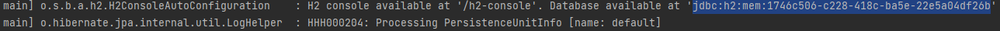
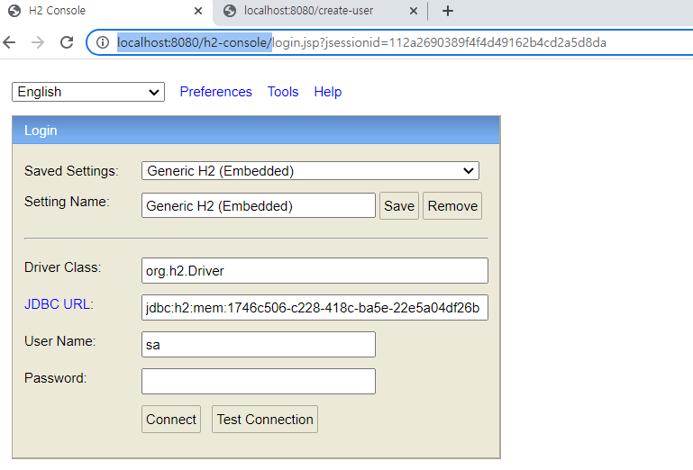

# [412]_점심시간 프로젝트
## [412_01]_점심시간 프로젝트 소개

# H2 DB 연결 및 테스트 방법

## 프로젝트를 실행후

    해당 값을 복사한뒤.. 
    http://localhost:8080/h2-console 로 접속한다.

  
    
    JDBC URL을 수정하고 Connect를 누르면..

# 완료

    해당 값은 JPA 로 생성했다.